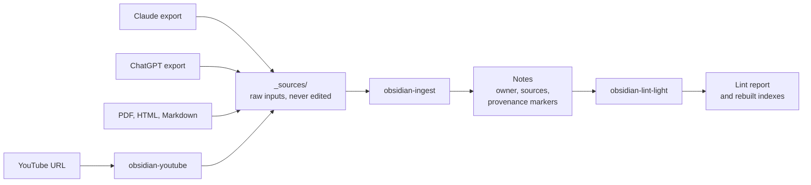

# obsidian-agent-vault

Agent skills that turn your AI chat history, YouTube videos, and documents into a linked Obsidian wiki. Every claim is traceable, and your own notes stay yours.

Export your Claude or ChatGPT conversations, paste a YouTube link, or drop a PDF into the vault. Your coding agent reads it, routes it to the right project, and writes or updates notes. Each note records the sources it came from. Each claim shows whether it came from a source or from the agent. Notes that you mark as your own are never changed.

It works with any agent that reads `AGENTS.md` or [Agent Skills](https://agentskills.io), for example Claude Code, Codex, and OpenCode.

## Features

- **Claude conversation exports.** Drop the export `.zip` in as downloaded. No unzip step.
- **Claude project exports.** Project docs become notes. Each project is routed once.
- **ChatGPT data exports.** You pick which conversations go in.
- **YouTube videos.** Give one or more links. The skill fetches the captions and writes notes with timestamp links.
- **Documents.** Markdown, HTML, and PDF.
- **Incremental by design.** Only new or changed content is processed. A chat that grew since the last export is read again only from the new messages.
- **Provenance on every claim.** Source, agent inference, or ambiguous.
- **Ownership on every note.** The agent never changes a note that you mark as yours.
- **Ingest status.** One command shows when you last ingested.
- **No runaway growth.** One command retires ingested exports and deletes them. The notes keep each file's hash.
- **Read-only lint.** It finds broken links, missing sources, and bad frontmatter. It reports and never fixes.

## Quick start

```bash
git clone https://github.com/DoxaLogosGit/obsidian-agent-vault.git
cd obsidian-agent-vault
pip install pyyaml
python3 install.py new ~/MyVault
```

Then open `~/MyVault` in Obsidian and start your agent in that folder:

1. Put a source file in `~/MyVault/_sources/`.
2. Ask the agent to run the `obsidian-ingest` skill. In Claude Code, type `/obsidian-ingest`.
3. Answer its routing questions.
4. Run `obsidian-lint-light` to audit the result.

## How it works



Ingest scans `_sources/` in one pass. It compares every source with what the notes already record, then processes only what is new or changed. It asks you where each unmatched item goes, and offers the closest existing note or folder.

Every folder gets an `index.md` that lists each note with a one-line summary. The master index is `_meta/index.md`. Agents read an index before they search, which keeps the token cost low.

## Sources in detail

### Claude conversations

Request a data export from Claude (Settings → Privacy). Drop the `.zip` into `_sources/` as downloaded, or let `/obsidian-fetch-export` place it (see [Fetching Claude exports](#fetching-claude-exports)).

- **Tracked per conversation.** Each note records the conversation ids it holds and their message counts. A new export of the same history is recognized, and only new or longer conversations are processed.
- **Files come too.** Files that you attached to a chat, and files that Claude created in it, are read with the conversation. For conversations ingested before this feature existed, run `/obsidian-files-backlog`. It lists the conversations with missing files and lets you pick.
- **Skip what you do not want.** Add a conversation id to `_meta/ignored-uuids.md`, and ingest never asks about it again.
- **Clean up old exports.** Each new export holds the full history, so older zips add nothing once ingested. Retire and delete them with `/obsidian-retire` (see [Cleaning up sources](#cleaning-up-sources)).

### Claude projects

The same export includes a `projects` zip. Each project doc is tracked by its own hash, so an unchanged doc is skipped even though every export makes a new zip.

The first time a project appears, ingest asks where it goes: a folder, a note, or `ignore`. It saves the answer in `_meta/project-routes.md`, and new docs from that project route without a prompt. If a doc is already in a note through a chat, ingest only records it and does not write the content twice.

### Fetching Claude exports

A Claude export does not arrive as one file. Claude gives you a small **manifest** file, `manifest-*.json`, with one download link per category: `conversations`, `projects`, `memories`, and `light_metadata`. The vault uses the first two.

Each link works **only once**, and **only in a browser that is signed in to claude.ai**. Your agent cannot download the zips for you: a request from a script gets HTTP 403. So the work is split. You click the links, and `/obsidian-fetch-export` does the rest.

1. In Claude, request a data export (Settings → Privacy → Export data).
2. When the export is ready, download the manifest to `~/Downloads`.
3. Run `/obsidian-fetch-export`. The agent runs `fetch_export.py`. It finds the newest manifest and prints one link for each category that you have not downloaded yet.
4. Open each link in your signed-in browser. The zips land in `~/Downloads`. Tell the agent when they are finished.
5. The agent runs the script again. For each zip, the script does one of these things:
   - **Places it** in `_sources/`. If the name is taken by different content, it uses a date-stamped name.
   - **Discards it** because the same export content is already in `_sources/`.
   - **Discards it** because a note records its hash. That export was ingested and retired earlier.
6. If anything new went in, the agent offers to run `/obsidian-ingest`.

The script never overwrites or deletes a file in `_sources/`. It compares the conversation content inside the zip, not the zip bytes, because two downloads of the same export differ in their packaging.

Useful flags: `--dry-run` to see what would happen, `--category conversations` to fetch only one category, and `--manifest <path>` to use an older manifest.

### ChatGPT conversations

Request a data export from ChatGPT (Settings → Data controls). Drop the `.zip` into `_sources/`.

- **You choose.** Ingest lists the new and longer conversations with title, date, and size. It does not ingest the whole dump by default.
- **Clean reads.** Only the final branch of each conversation is read. Abandoned regenerations and reasoning traces are dropped.
- **Attachments.** Images never enter the vault. A PDF is read only when you approve that file.
- **Tracked per conversation.** A ChatGPT export is a full dump every time, so its file hash always changes. Ingest tracks each conversation id and its message count in the notes, not the zip.
- **No long-term growth.** Each dump repeats everything, so keeping them fills `_sources/` fast. After you check the notes, run `/obsidian-retire` to delete the export (see [Cleaning up sources](#cleaning-up-sources)).

### YouTube

```
/obsidian-youtube https://www.youtube.com/watch?v=<id> [more urls...] [--lang de] [--fetch-only]
```

- The skill downloads captions only, never video, into a transcript file in `_sources/`. Then it runs ingest.
- Notes cite claims with timestamp links, for example `[12:34](https://www.youtube.com/watch?v=<id>&t=754s)`.
- If only auto-generated captions exist, claims that depend on a possibly misheard word are marked `^[ambiguous]`.
- `--lang` picks the caption language. The default is `en`. `--fetch-only` stops after the download.
- A video with no captions fails. There is no speech-to-text fallback.

### Documents

Markdown, HTML, and PDF files in `_sources/` are tracked by SHA-256. A changed file adds a dated update section to its note instead of a rewrite.

Published works stay out. The skills do not ingest the text of books, manuals, or rulebooks. They record the title, the edition, and the decision you made instead.

## Cleaning up sources

`_sources/` grows with every export. Once a source is ingested, its content lives in your notes, and the file only takes space. `/obsidian-retire` removes such files without losing track of them.

1. Run `/obsidian-retire`. The agent lists every file whose content is fully in your notes, with its size and the number of notes that cite it. You pick which ones go.
2. The agent runs a dry run and shows what would change.
3. After you confirm, `retire_sources.py` marks each citing `sources:` entry `retired: true`, keeps its hash, and deletes the file.

You can also name files directly: `/obsidian-retire _sources/<file> [...]`.

The script keeps a file, and tells you why, if:

- no note cites it, so deleting it would lose content
- it changed after ingest, so part of it never reached a note
- an `owner: human` note cites it, because the agent never edits that note

The retired hash stays in the notes. If you download the same export again, ingest and `/obsidian-fetch-export` still recognize it. Lint counts retired entries under "Retired sources", not as errors.

## Everyday commands

| Command | What it does |
|---|---|
| `/obsidian-ingest` | Ingest everything new or changed in `_sources/`. |
| `/obsidian-status` | Print the time of the last ingest. Reads nothing else and writes nothing. |
| `/obsidian-fetch-export` | Bring a new Claude export from `~/Downloads` into `_sources/`. |
| `/obsidian-youtube <url> [...]` | Fetch YouTube transcripts, then ingest them. |
| `/obsidian-files-backlog` | Add chat files to conversations ingested before file support. |
| `/obsidian-retire [file ...]` | Retire ingested sources and delete them. Asks before it deletes. |
| `/obsidian-lint-light` | Audit the vault and write a report to `_meta/`. |
| `/obsidian-lint-light --rebuild-indexes` | Audit, then regenerate every `index.md`. |

The slash form is for Claude Code. With other agents, ask for the skill by name, for example "run obsidian-status". `/obsidian-ingest --status` and `/obsidian-ingest --files-backlog` also still work.

## The rules

Three rules keep an agent-edited wiki trustworthy.

**Every note has an owner.**

| `owner` | What the agent does |
|---|---|
| `human` | Reads and cites the note. It never changes it. If a change is needed, it shows a diff and stops. |
| `agent` | Updates the note freely. |
| `shared` (default) | Updates the note, but keeps the sections you wrote. |

**Every claim shows where it came from.**

```markdown
- Intervals differ per plant, from 3 to 10 days.
- A plain file is enough for storage at this size. ^[inferred]
- Do intervals change by season? The user was not sure. ^[ambiguous]
```

A line with no marker comes from a source. `^[inferred]` marks the agent's own synthesis. `^[ambiguous]` marks sources that disagree or are unclear.

**Sources are immutable.** Raw inputs stay in `_sources/` exactly as you added them. Each note lists them in its frontmatter:

```yaml
sources:
  - path: _sources/example-chat.md
    sha256: 08872e3d...
ingested_uuids:
  - uuid: <conversation id>
    message_count: 42
    last_ingested: 2026-09-26T12:00:00Z
```

`vault/AGENTS.md` holds the full rules that the agent follows. `vault/_meta/schema.md` holds the details. The example notes in `vault/Projects/Example/` show each rule in use.

## What is in this repository

```
obsidian-agent-vault/
├── install.py          installer for a new or an existing vault
├── skills/
│   ├── obsidian-ingest/                ingest entry point, plus the fetch and retire scripts
│   ├── obsidian-claude-export-ingest/  the Claude conversation workflow that ingest calls
│   ├── obsidian-youtube/               fetch YouTube transcripts, then ingest
│   ├── obsidian-fetch-export/          bring a Claude export from ~/Downloads into _sources/
│   ├── obsidian-retire/                retire and delete ingested sources
│   ├── obsidian-status/                print the time of the last ingest
│   ├── obsidian-files-backlog/         add chat files to older conversations
│   └── obsidian-lint-light/            read-only audit and index rebuild
├── vault/              the starter vault
│   ├── AGENTS.md       the rules the agent follows
│   ├── CLAUDE.md       imports AGENTS.md for Claude Code
│   ├── _meta/          schema, folder config, indexes, design log
│   ├── _sources/       one sample source
│   └── Projects/Example/  three example notes, one per owner type
└── tests/
```

## Dependencies

| Dependency | Needed for | Install |
|---|---|---|
| Python 3.13 or later | Everything | [python.org](https://www.python.org/downloads/) |
| PyYAML | Everything | `pip install pyyaml` |
| An agent that loads Agent Skills or reads `AGENTS.md` | Running the skills | Claude Code, Codex, OpenCode |
| [`yt-dlp`](https://github.com/yt-dlp/yt-dlp) | `obsidian-youtube` | `pip install yt-dlp` |
| `pdftotext` (poppler) | PDF sources | `apt install poppler-utils`, `dnf install poppler-utils`, or `brew install poppler` |
| A browser signed in to claude.ai | Downloading Claude exports | — |
| Obsidian CLI (`obsidian` on your `PATH`) | The orphan-note check in lint. Optional: lint skips the check without it. | See the Obsidian docs |

Only Python and PyYAML are required. Each other item is needed only for the feature in its row.

## Install

### A new vault

```bash
python3 install.py new ~/MyVault
```

This copies the starter vault, with the example notes, and installs the skills. The target folder must be empty or not exist.

### An existing vault

```bash
python3 install.py into ~/ExistingVault
```

This adds the skills, `AGENTS.md`, `CLAUDE.md`, `_meta/`, and an empty `_sources/`. It does not copy the example notes. After it runs, do these steps:

1. Edit `_meta/vault-config.yml` and list your own top-level folders. The skills ignore every folder that the config does not list.
2. Build the indexes:

   ```bash
   python3 .agents/skills/obsidian-lint-light/lint.py --rebuild-indexes
   ```

3. Look for `.new` files. The installer never overwrites a file. If a file exists and differs, it writes the package version next to it as `<name>.new`. Merge the two by hand.

### Where the skills go

Both modes copy the skills to `.agents/skills/`. Codex and OpenCode read that folder. The installer also links `.claude/skills` to it for Claude Code. If your system cannot create the link, for example on Windows without developer mode, the installer copies the skills instead.

### Update

```bash
git pull
rm -rf ~/MyVault/.agents/skills
python3 install.py into ~/MyVault
```

If the installer copied the skills to `.claude/skills` instead of a link, delete that folder too before you run `into`.

## Configure the folders

`_meta/vault-config.yml` lists the folders the skills use:

```yaml
writable_roots: [Projects, Ideas, Reference]   # ingest may write here
audited_roots: [Projects, Ideas, Reference]    # lint audits and indexes these
index_rollup_roots: []                         # subfolders share one index
```

- Put every writable root in `audited_roots` too.
- To protect a folder from ingest, add it to `audited_roots` only.
- Use `index_rollup_roots` for a tree where each subfolder holds one note. One index at the top is easier to read than many small ones.

## Run the tests

```bash
python3 -m pytest tests
```

The skill tests need a vault around them. Run them in an installed vault:

```bash
python3 -m pytest ~/MyVault/.agents/skills
```

## Contributing

Issues and bug reports are welcome. The skills come from the maintainer's own vault, and a script regenerates `skills/` from it. A pull request that changes `skills/` is ported by hand, so describe the change clearly. Changes to `install.py`, `vault/`, and the docs merge as usual.

## License

MIT. See [`LICENSE`](LICENSE).
