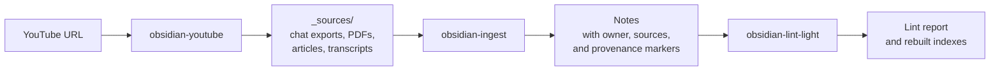

# obsidian-agent-vault

Agent skills that turn your raw sources into a linked Obsidian wiki. Every claim is traceable, and your own notes stay yours.

Drop a chat export, a PDF, an article, or a YouTube link into the vault. Your coding agent reads it, routes it to the right project, and writes or updates notes. Each note records the sources it came from. Each claim shows whether it came from a source or from the agent. Notes that you mark as your own are never changed.

It works with any agent that reads `AGENTS.md` or [Agent Skills](https://agentskills.io), for example Claude Code, Codex, and OpenCode.

## Quick start

```bash
git clone https://github.com/<you>/obsidian-agent-vault.git
cd obsidian-agent-vault
pip install pyyaml
python3 install.py new ~/MyVault
```

Then open `~/MyVault` in Obsidian and start your agent in that folder:

1. Put a source file in `~/MyVault/_sources/`.
2. Ask the agent: "Run the obsidian-ingest skill."
3. Answer its routing questions.
4. Ask the agent: "Run obsidian-lint-light." It audits the result.

## How it works



- **Ingest** tracks each source by its SHA-256 hash. It processes only new or changed sources. For Claude exports, it tracks each conversation, so a long chat that grows is ingested again only for the new messages.
- **Indexes** at `_meta/index.md` and in each folder list every note with a one-line summary. Agents read an index before they search, which keeps the token cost low.
- **Lint** reports broken links, missing or changed sources, bad frontmatter, and drift in the provenance counts. It does not fix anything. You decide.

## The rules

Three rules keep an agent-edited wiki trustworthy.

**Every note has an owner.**

| `owner` | What the agent does |
|---|---|
| `human` | Reads and cites the note. It never changes it. If a change is needed, it shows a diff and stops. |
| `agent` | Updates the note freely. |
| `shared` (default) | Updates the note, but keeps the sections you wrote. |

**Every claim shows where it came from.**

```markdown
- Intervals differ per plant, from 3 to 10 days.
- A plain file is enough for storage at this size. ^[inferred]
- Do intervals change by season? The user was not sure. ^[ambiguous]
```

A line with no marker comes from a source. `^[inferred]` marks the agent's own synthesis. `^[ambiguous]` marks sources that disagree or are unclear.

**Sources are immutable.** Raw inputs stay in `_sources/` exactly as you added them. Each note lists them in its frontmatter:

```yaml
sources:
  - path: _sources/example-chat.md
    sha256: 08872e3d...
```

`vault/AGENTS.md` holds the full rules that the agent follows. `vault/_meta/schema.md` holds the details. The example notes in `vault/Projects/Example/` show each rule in use.

## What is in this repository

```
obsidian-agent-vault/
├── install.py          installer for a new or an existing vault
├── skills/
│   ├── obsidian-ingest/                ingest any file in _sources/
│   ├── obsidian-claude-export-ingest/  the Claude export workflow that ingest calls
│   ├── obsidian-youtube/               fetch YouTube transcripts, then ingest
│   └── obsidian-lint-light/            read-only audit and index rebuild
├── vault/              the starter vault
│   ├── AGENTS.md       the rules the agent follows
│   ├── CLAUDE.md       imports AGENTS.md for Claude Code
│   ├── _meta/          schema, folder config, indexes, design log
│   ├── _sources/       one sample source
│   └── Projects/Example/  three example notes, one per owner type
└── tests/
```

## Requirements

- Python 3.13 or later
- PyYAML: `pip install pyyaml`
- An agent that loads Agent Skills or reads `AGENTS.md`
- Optional: [`yt-dlp`](https://github.com/yt-dlp/yt-dlp) for `obsidian-youtube`
- Optional: the Obsidian CLI, for the orphan-note check in lint. Without it, lint skips that check.

## Install

### A new vault

```bash
python3 install.py new ~/MyVault
```

This copies the starter vault, with the example notes, and installs the skills. The target folder must be empty or not exist.

### An existing vault

```bash
python3 install.py into ~/ExistingVault
```

This adds the skills, `AGENTS.md`, `CLAUDE.md`, `_meta/`, and an empty `_sources/`. It does not copy the example notes. After it runs, do these steps:

1. Edit `_meta/vault-config.yml` and list your own top-level folders. The skills ignore every folder that the config does not list.
2. Build the indexes:

   ```bash
   python3 .agents/skills/obsidian-lint-light/lint.py --rebuild-indexes
   ```

3. Look for `.new` files. The installer never overwrites a file. If a file exists and differs, it writes the package version next to it as `<name>.new`. Merge the two by hand.

### Where the skills go

Both modes copy the skills to `.agents/skills/`. Codex and OpenCode read that folder. The installer also links `.claude/skills` to it for Claude Code. If your system cannot create the link, for example on Windows without developer mode, the installer copies the skills instead.

### Update

```bash
git pull
rm -rf ~/MyVault/.agents/skills
python3 install.py into ~/MyVault
```

If the installer copied the skills to `.claude/skills` instead of a link, delete that folder too before you run `into`.

## Configure the folders

`_meta/vault-config.yml` lists the folders the skills use:

```yaml
writable_roots: [Projects, Ideas, Reference]   # ingest may write here
audited_roots: [Projects, Ideas, Reference]    # lint audits and indexes these
index_rollup_roots: []                         # subfolders share one index
```

- Put every writable root in `audited_roots` too.
- To protect a folder from ingest, add it to `audited_roots` only.
- Use `index_rollup_roots` for a tree where each subfolder holds one note. One index at the top is easier to read than many small ones.

## Run the tests

```bash
python3 -m pytest tests
```

The skill tests need a vault around them. Run them in an installed vault:

```bash
python3 -m pytest ~/MyVault/.agents/skills
```

## Contributing

Issues and bug reports are welcome. The skills come from the maintainer's own vault, and a script regenerates `skills/` from it. A pull request that changes `skills/` is ported by hand, so describe the change clearly. Changes to `install.py`, `vault/`, and the docs merge as usual.

## License

MIT. See [`LICENSE`](LICENSE).
